# 웹서버를 도커로 CI 구축 및 무중단 배포하기 (Jenkins + Slack + Gradle + Docker)

본 문서는 도커로 웹서비스를 연동하는것이 주 목적입니다. 만약 도커로 웹서비스를 연동하는것만 테스트 하고 싶으신분께서는 ```jenkins```, ```slack```과정은 필수가 아니 생략해주셔도 작동 합니다.

2가지 방법으로 구현했다. 다른 한가지는 아래에 적재 하도록 한다
\!이벤트를 감지하는 docker-gen으로 구현한 웹 서비스 컨테이너 [https://github.com/yoojaehoon/dcgen_kkp.git]

### 스프링부트 프로젝트 생성

springboot_webui를 clone 받아주세요.
https://github.com/yoojaehoon/kakao_devops_springwebui.git

빌드 테스트는 springboot-web-ui를 소스코드로 사용했습니다.
빌드도구는 ```Gradle```을 사용합니다.  
본인의 서버에서 Gradle을 다운로드 받으시고 (https://gradle.org/install/) 프로젝트를 생성 해주세요.
Task 실행 테스트를 위해 간단한 Task만 ```build.gradle```에 추가하겠습니다.
저는 빌드후 print와 jar를 넣어주는 plant_jar를 추가했습니다.

```./gradlew build plang_jar``` 를 실행해 주세요
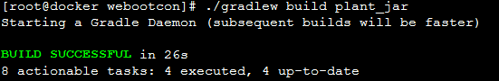

### 도커 인스톨
컨테이너 기반의 웹서버를 돌리기 위해 docker 엔진을 설치합니다.

```
# 의존성 설치
$ sudo yum install -y yum-utils device-mapper-persistent-data lvm2

# yum config manager를 통한 docker engine repo 추가
$ sudo yum-config-manager \
    --add-repo \
    https://download.docker.com/linux/centos/docker-ce.repo

# yum 패키지 색인
$ sudo yum makecache fast

# docker engine community edition 설치
$ sudo yum -y install docker-ce

# docker engine 시작
$ sudo systemctl start docker
```

### 도커 컴포즈 설치
```
curl -L https://github.com/docker/compose/releases/download/버전/docker-compose-`uname -s`-`uname -m` > /usr/local/bin/docker-compose
(버전은 https://github.com/docker/compose/releases 여기에서 참고하였습니다. 본 문서는 1.24.0-rc1 버전을 사용하였습니다)
sudo chmod +x /usr/local/bin/docker-compose
```

### jenkins 설치
빌드후 배포할수 있도록 jenkins를 설치후 git과 연동할 것이다.
이를 위해 물리호스트에 설치할수도 있지만 docker는 한줄이면 jenkins_ci를 사용할수 있다.
https://github.com/jenkinsci/docker 에서 제공하는 이미지를 사용하면 한줄이면 올릴수 있다

```
docker run -d -v jenkins_home:/var/jenkins_home -p 8080:8080 -p 50000:50000 jenkins/jenkins:lts
```
jenkins의 볼륨을 로컬과 연결해야 데이터가 사라지지 않으니 -v jenkins_home:/var/jenkins_home은 맞춰주도록 하자

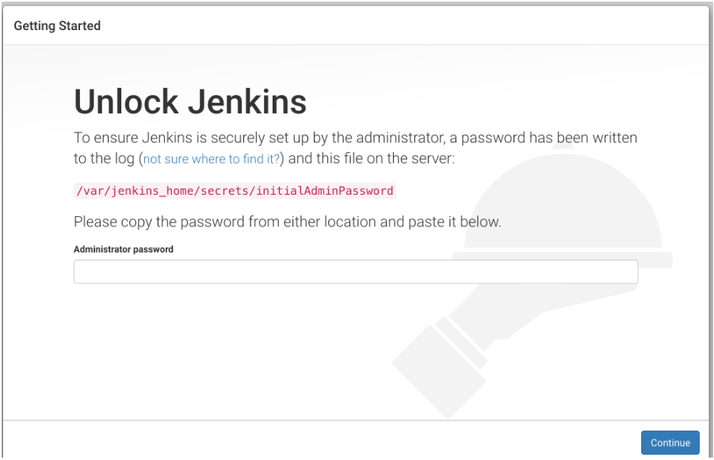

패스워드는 docker 안에 들어있다.
```docker exec -i -t jenkins /bin/bash
cat /var/jenkins_home/secrets/initialAdminPassword
```
콘솔에서 한번 패스워드를 넣어주고 설정하게 되면 파일은 사라지므로 일부러 삭제하지 않아도 된다

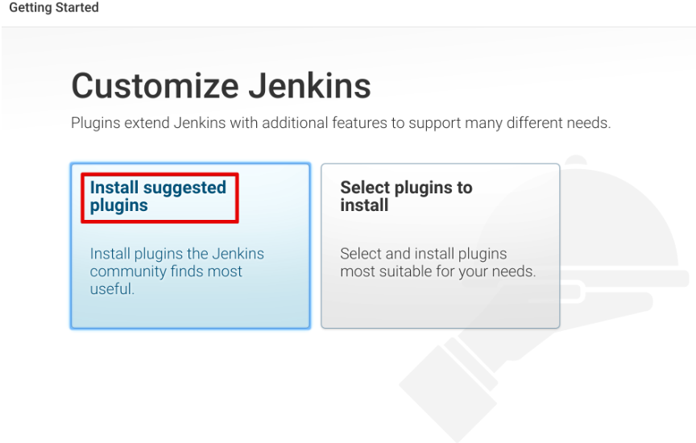

필자는 install suggested plugins를 선택했다. git 플러그인이 포함되서 따로 수동설치 안해도 된다.

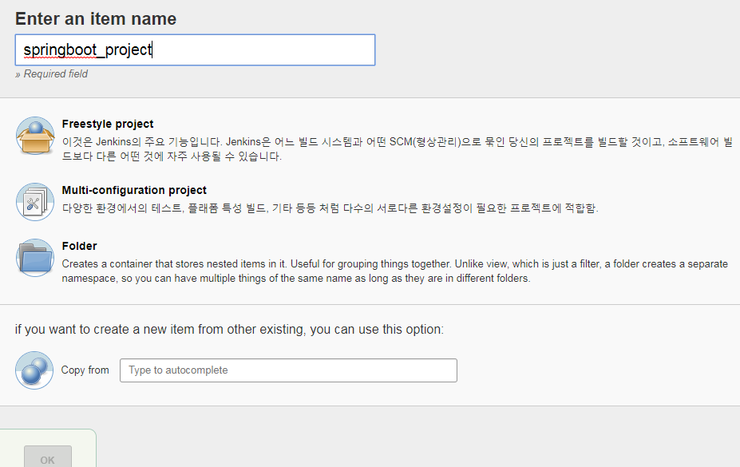

FreeStyle Project를 선택하고 프로젝트이름 "springboot_project (마음대로 지정해줘도 된다)"를 넣어준다

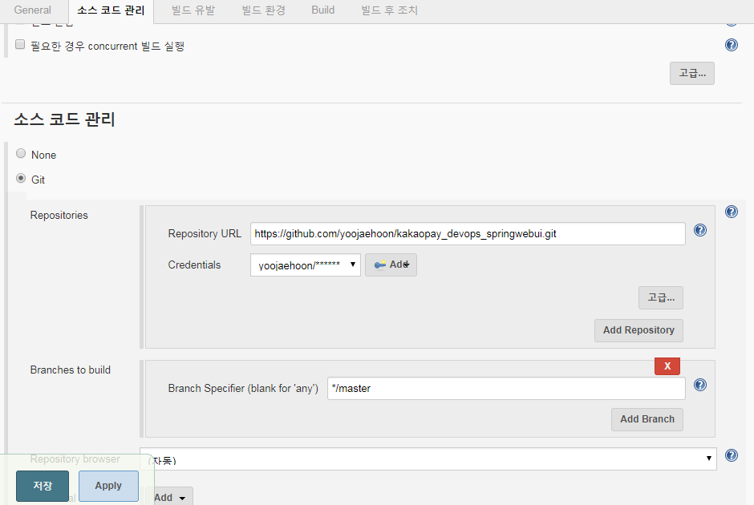

Items 설정화면에서 ```소스 코드 관리``` 메뉴의 Repository URL에 git 저장소를 등록해준다
아래 Credential 항목에 유저를 등록해준다. github에서 사용하는 계정과 패스워드를 넣어준다

branch는 관리할 브랜치선택을 하는건데 master로 선택했다. 브랜치를 선택한것에 따라 빌드가 유발된다
빌드 유발은 체크박스 ```GitHub hook trigger for GITScm polling``` 를 선택한다

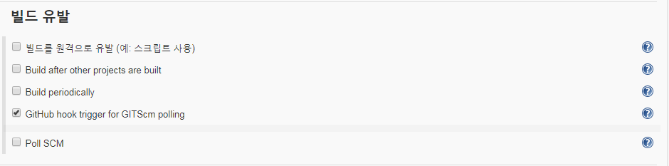

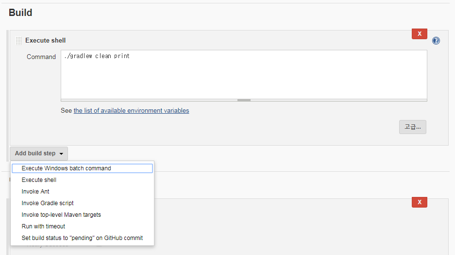

Add build step에서 빌드하는 스크립트를 넣을수 있도록 선택해준다. git에서는 gradle build가 필요 없다고 생각했다. gradle clean를 넣는다

## Github과 jenkin 연동하기
빌드할때 성공했는지 실패했는지 메시지 받을수 있도록 을 연결한다. 옛날에는 Integrations & services에서 지원되었는데 어느순간 Webhooks로 옮겨갔다

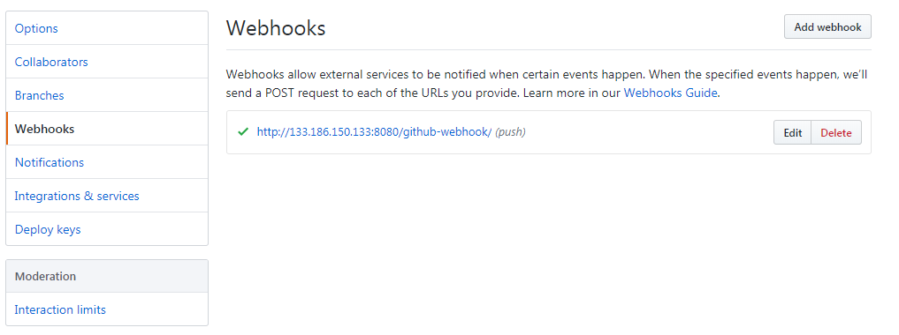

만들어져있는 jenkins url 웹훅 주소를 넣으면 이제부터 git이 push할때마다 빌드를 알아서 하게 될것이다


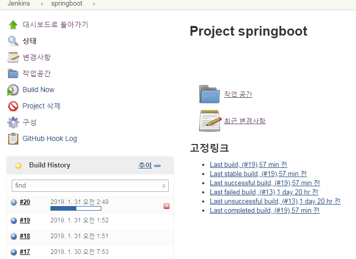

push되면 빌드 상태가 되는것이 보일것이다

## Slack 과 jenkins 연결하기
빌드될때 이벤트 수신하기위해 플러그인을 연동한다

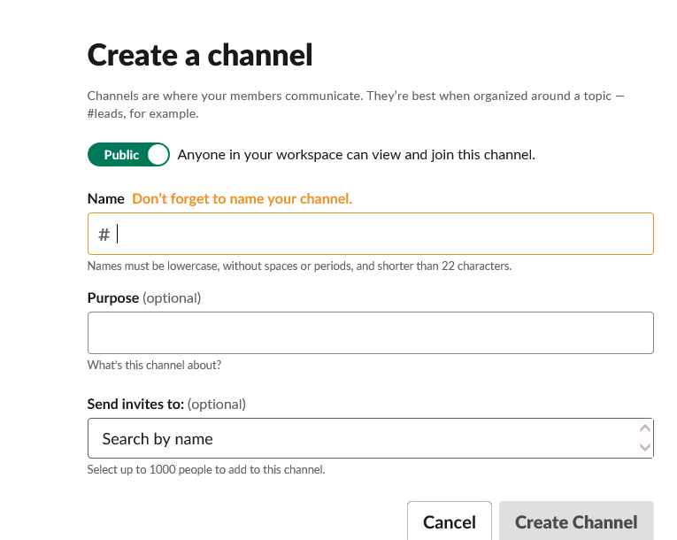

채널을 만들어준다

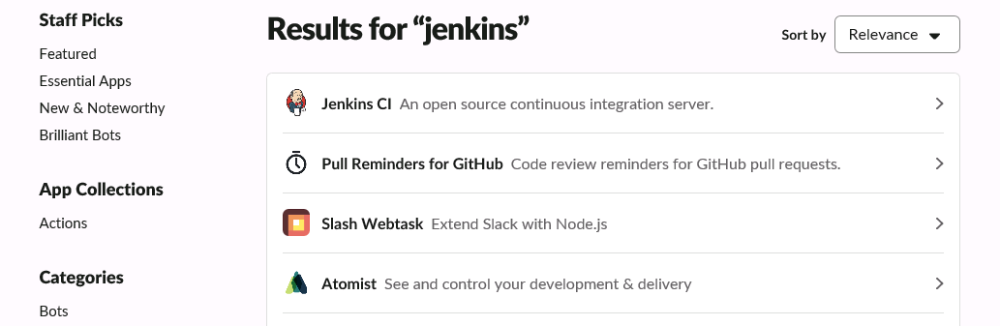

Slack에서 jenkins 플러그인을 연결

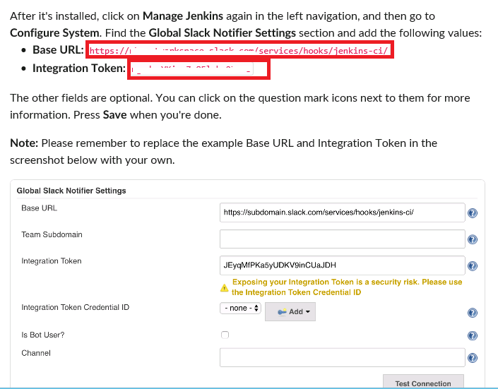

메뉴얼에서 제공하는 ```url```과 ```토큰```을 jenkins에 입력한다

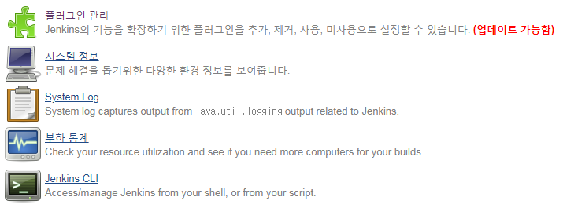

jenkins에서 "jenkins 관리" -> "플러그인 관리" -> "설치 가능" -> "slack notification" 를 검색한다
기본 설치되는 플러그인이 아니므로 인스톨하고 다시 "jenkins 관리" -> "시스템 설정" 으로 이동해서 아까 받은 ```url```과 ```토큰```을 넣는다

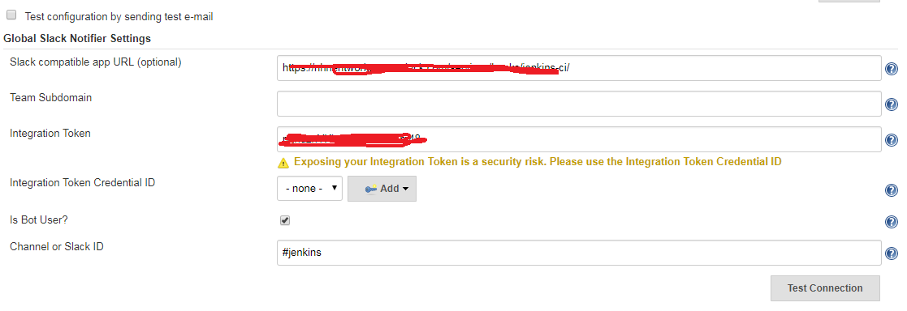
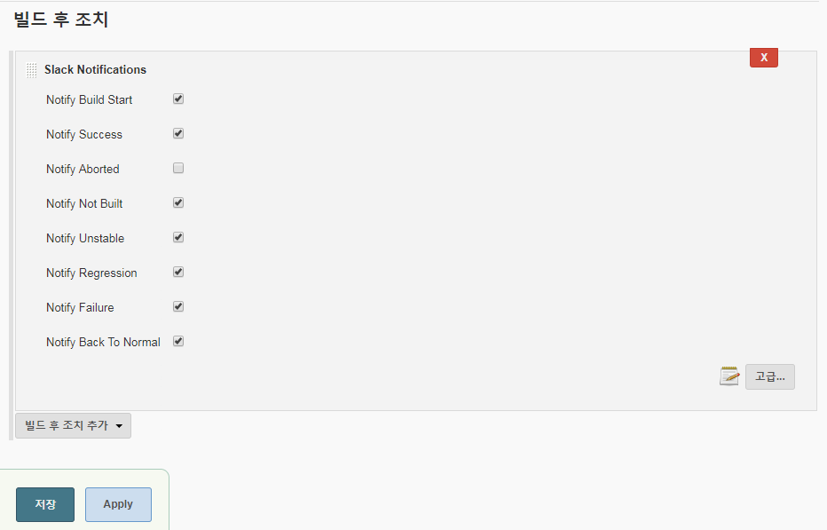

이제 jenkins의 프로젝트에서 빌드후 조치 항목에 slack notification 이 추가되어 있을것이다

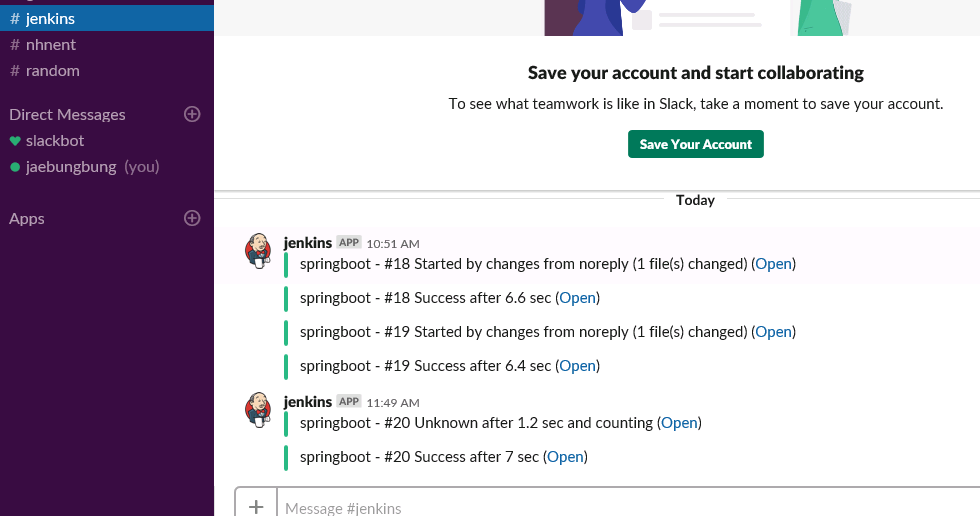

빌드 될때마다 메시지를 slack으로 연락받아 확인이 가능하다

## Docker로 nginx와 springboot 연동하여 무중단 배포하기

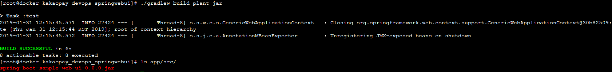
```git clone https://github.com/yoojaehoon/kakaopay_devops_springwebui.git
cd kakaopay_devops_springwebui
./gradlew build plant_jar
```

명령어 목록
```
usage: deploy.py [-h] [-o {table,minimal}] <subcommand> ...

KAKAO_PAY_Devops docker manager

positional arguments:
  <subcommand>
    start               Start the docker containers.
    stop                Stop the docker containers.
    restart             Restart the docker containers.
    deploy              Deploy the docker containers.
    status              Status the docker containers.

optional arguments:
  -h, --help            show this help message and exit
  -o {table,minimal}, --output {table,minimal}
                        Output format. (default: table)
```

컨테이너 시작
```
[root@docker kakaopay_devops_springwebui]# ./deploy.py start

Creating network "kakaopay_devops_springwebui_default" with the default driver
Creating kakaopay_devops_springwebui_app_1 ... done
Creating jh_nginx                          ... done


+--------------+----------+
| Feild        | Value    |
+--------------+----------+
| afe858f71fa0 | jh_nginx |
+--------------+----------+
+--------------+-----------------------------------+
| Feild        | Value                             |
+--------------+-----------------------------------+
| 1a90ecadf528 | kakaopay_devops_springwebui_app_1 |
+--------------+-----------------------------------+
```

컨테이너 개수 확장
```
[root@docker kakaopay_devops_springwebui]# ./deploy.py start --app 3

Starting kakaopay_devops_springwebui_app_1 ... done
Creating kakaopay_devops_springwebui_app_2 ... done
Creating kakaopay_devops_springwebui_app_3 ... done
jh_nginx is up-to-date

+--------------+----------+
| Feild        | Value    |
+--------------+----------+
| afe858f71fa0 | jh_nginx |
+--------------+----------+
+--------------+-----------------------------------+
| Feild        | Value                             |
+--------------+-----------------------------------+
| 6a1620407c07 | kakaopay_devops_springwebui_app_3 |
| f4844aa050ef | kakaopay_devops_springwebui_app_2 |
| 1a90ecadf528 | kakaopay_devops_springwebui_app_1 |
+--------------+-----------------------------------+
```

컨테이너 중지 명령
```
[root@docker kakaopay_devops_springwebui]# ./deploy.py stop

Stopping kakaopay_devops_springwebui_app_2 ... done
Stopping kakaopay_devops_springwebui_app_3 ... done
Stopping jh_nginx                          ... done
Stopping kakaopay_devops_springwebui_app_1 ... done
Removing kakaopay_devops_springwebui_app_2 ... done
Removing kakaopay_devops_springwebui_app_3 ... done
Removing jh_nginx                          ... done
Removing kakaopay_devops_springwebui_app_1 ... done
Removing network kakaopay_devops_springwebui_default


running nginx container is zero
running nginx container is zero
```

컨테이너 개별 중지
```
[root@docker kakaopay_devops_springwebui]# ./deploy.py status
------NGINX Status------
+--------------+----------+
| Feild        | Value    |
+--------------+----------+
| fd14ab4b536a | jh_nginx |
+--------------+----------+
------APP Status--------
+--------------+-----------------------------------+
| Feild        | Value                             |
+--------------+-----------------------------------+
| 69b3c326512c | kakaopay_devops_springwebui_app_2 |
| eb11a2317f82 | kakaopay_devops_springwebui_app_1 |
+--------------+-----------------------------------+
[root@docker kakaopay_devops_springwebui]# ./deploy.py stop --container kakaopay_devops_springwebui_app_2
STX---Docker service's down------

docker container stop kakaopay_devops_springwebui_app_2
docker container rm kakaopay_devops_springwebui_app_2
------Docker service's up---ETX

+--------------+-----------------------------------+
| Feild        | Value                             |
+--------------+-----------------------------------+
| eb11a2317f82 | kakaopay_devops_springwebui_app_1 |
+--------------+-----------------------------------+

[root@docker kakaopay_devops_springwebui]# ./deploy.py stop --container kakaopay_devops_springwebui_app_1
At least 1 app service is must running
+--------------+-----------------------------------+
| Feild        | Value                             |
+--------------+-----------------------------------+
| eb11a2317f82 | kakaopay_devops_springwebui_app_1 |
+--------------+-----------------------------------+

```

컨테이너 모두 재시작
```
[root@docker kakaopay_devops_springwebui]# ./deploy.py restart
BEFORE
+--------------+----------+
| Feild        | Value    |
+--------------+----------+
| fd14ab4b536a | jh_nginx |
+--------------+----------+
+--------------+-----------------------------------+
| Feild        | Value                             |
+--------------+-----------------------------------+
| eb11a2317f82 | kakaopay_devops_springwebui_app_1 |
+--------------+-----------------------------------+
Restarting the containers app , jh_nginx
AFTER
+--------------+----------+
| Feild        | Value    |
+--------------+----------+
| ae28154d6896 | jh_nginx |
+--------------+----------+
+--------------+-----------------------------------+
| Feild        | Value                             |
+--------------+-----------------------------------+
| 535b87000e62 | kakaopay_devops_springwebui_app_1 |
+--------------+-----------------------------------+
```

컨테이너 디플로이
```
[root@docker kakaopay_devops_springwebui]# ./deploy.py deploy
ID : 535b87000e62 Name : kakaopay_devops_springwebui_app_1

STX---Docker pull the Image------

Pulling app   ... done
Pulling nginx ... done

------Docker pull the Image---ETX

STX---Docker service's up------

Starting kakaopay_devops_springwebui_app_1 ... done
Creating kakaopay_devops_springwebui_app_2 ... done
Starting jh_nginx                          ... done

------Docker service's up---ETX

STX---Docker service's down------

docker container stop 535b87000e62
docker container rm 535b87000e62
------Docker service's up---ETX

ID : 4a7295ba3d14 Name : kakaopay_devops_springwebui_app_2

Deploy : True , Output : Finish
```
